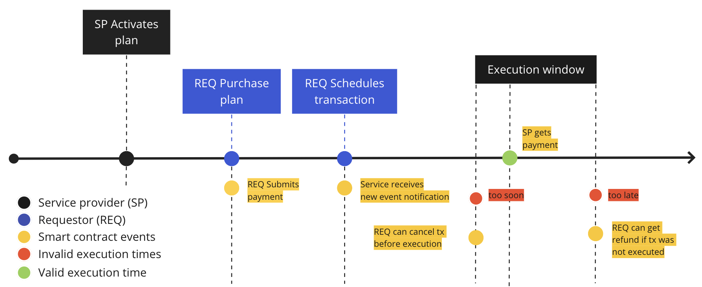

The main motivation of this project is to build a reliable service
that allows users to schedule Rootstock (RSK) transactions that will be executed
in the future by a third party.

## Quick start

Install [the SDK](sdk) in your dapp's front-end to **enable your users to schedule transactions**.

Read how to [**run your own scheduler**](run) and start making revenue.

## Model

A requester (REQ) makes the payment of the service
for a given number of transactions to be executed.
The Service Provider (SP) provider will be the one who will
execute the transaction and receive the payment in return.

1. REQ buys the service.
   Pays in RIF tokens, RBTC, or any ERC20 whitelisted token
   for an amount of transactions that can be scheduled in the future.
   The SP is going to execute the transaction and receive the payment in return
1. The payment is locked until each transaction is executed.
1. REQ wants to schedule a transaction.
   The transaction has a destination account and a data field,
   and a given time of execution.
   REQ submits this in the SP's smart contract.
   The SP service is notified of the new transaction requested.
1. The alarm rings and the SP submits the transaction.
1. The transaction is confirmed.
   REQ is notified and SP gets paid for their service.

## Design & architecture

The service is designed in three layers:

- **The smart contracts layer** -
  the transaction scheduling logic and the payment model
  for the scheduling service are executed in this layer.
  [Read more](contracts)
- **The service layer** -
  this layer implements everything necessary so that
  the service provider can execute transactions in a timely manner.
  It listens to new schedules and executes them in the given time.
  [Read more](services)
- **The SDK** -
  a front-end library for scheduling transactions with web3 providers.
  [Read more](sdk)

## Repos

- [`@rsksmart/rif-scheduler-contracts`](https://github.com/rsksmart/rif-scheduler-contracts)
- [`@rsksmart/rif-scheduler-services`](https://github.com/rsksmart/rif-scheduler-services)
- [`@rsksmart/rif-scheduler-sdk`](https://github.com/rsksmart/rif-scheduler-sdk)

_[Collaboration guidelines](../identity/contribute)_
