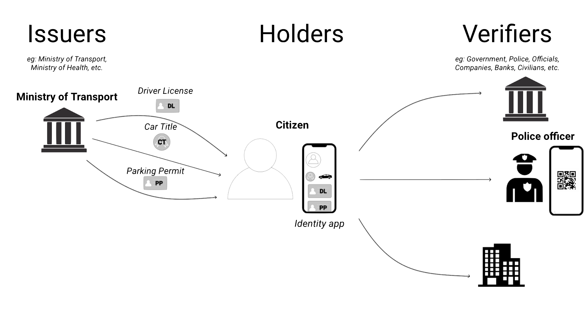

## The MVP

The RIF Identity MVP has the objective to develop a basic model putting into action the different tools known today in the field of self-sovereign identity:
- Identity management in public ledgers
- Issuance and verification of digitally signed credentials
- User-centric cloud storage
- Identity and credential authentication

The model is the emission of ID Cards, Driving Licenses and Parking Permits. _Citizens_ use a [mobile wallet application](applications/holder-app) where they input their identity details like name and age, and request any of these credentials to the _government_. The _government agent_ accesses a [web application](applications/issuer-app) where all the credential requests are listed and can be manually granted. Once credentials are granted, _Citizens_ store them in a user-centric cloud storage called [_The Data Vault_](/rif/identity/data-vault). _Police officers_ can verify _citizen's_ credentials scanning a QR code using another [mobile application](applications/verifier-app).

To understand the model we identify three actors:
- An issuer: the government
- A holder: a citizen
- A verifier: a police officer

### The user story

The main user story across this project is:
1. As a citizen I would like to request for a driving licence credential with my mobile phone
  - I want to be asked before sharing my personal information
1. As  the Government I would like to issue credentials when requested
  - I want to validate citizen information
  - The credentials must be digitally signed
  - The credentials must comply with [W3C VCs specs](../specs/#verifiable-credentials-model)
1. As a citizen I would like to store the credential issued by the MoT  in my phone
1. As a citizen I would like to access a list of my credentials and its details with my phone
1. As a citizen I would like to present a credential in form of QR when a police officer ask for it
1. As a Police officer I would like to verify a credential presentation made by a physically presents in form of QR
  - The credential must be a valid W3C VCs credential presentation
  - I want to view the citizen’s personal information
1. As a citizen I would like to backup every credential I receive and be able to restore it

---

Continue reading:
- [Run the project locally](run)
- [Read more about the design & architecture](architecture)
- [Use and modify the applications](applications)
- [Run the services](services)
- [Learnings](learnings)
- [Acknowledgements](acknowledgements)
