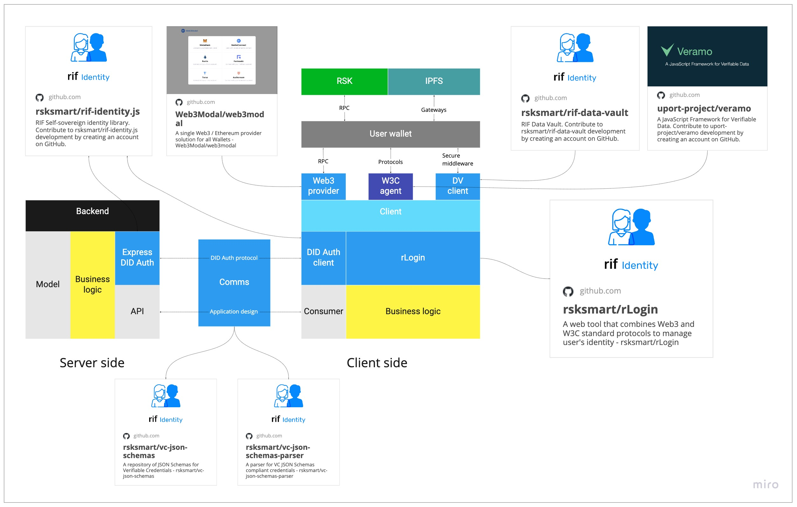

## rLogin

rLogin allows web application developers to integrate blockchain technologies giving the user the power of data portability. After integrating rLogin you achieve:
- a back-end authenticating users by their wallet addressed - their Decentralized Identifiers
- a registration model capable of requesting users for data stored in its user-centric cloud storage, the [Data Vault](../data-vault)
- a front-end capable of interacting with any wallet that the user chooses, with a pre-designed user experience for registration and login
- compatibility with a unified platform where the user can control their identity and information, the [RIF Identity Manager](../manager)

### State of the art

We identify there are two types of decentralized applications: applications with a back-end and applications without a back-end. Applications without a backend interact directly with the blockchain, and probably with some public service (eg: RNS). Backend applications need a type of authentication that confirms the users are in control of their wallet (thus, their private keys) at the time of use (eg: Money on Chain). We call this the web 3.0.

There are web 2.0 applications, where confidence in the authenticity of users relies on services provided by third parties, such as [Google Authentication](https://developers.google.com/identity). These applications require that the user log in to their account in a third party service. This third party service shares the user's private information, giving the application the necessary information to authenticate the user. The information is in control of the third-party, which can use it arbitrarily to gain future access.

Today's decentralized apps have no way of requiring private user information in a unified way. Nor is there any platform that allows an application to obtain reliable proof that a user was authenticated by a third party service without having to communicate with it.

### Design & Architecture

The rLogin design consists of 4 core modules:

- A back-end authentication library
- A cloud storage service where users can store their credentials
- A standard interface for Verifiable Credentials enabling data portability
- A client library combining authentication against back-end using user's wallet and store credentials

[Read more](./architecture)

### Libraries



### Integrate



See the [current integrations](./integrations) as a reference

---

- [Integrate](integrate)
- [Integrations](integrations)
- [Design & architecture](architecture)
- [Libraries](libraries)
  - [rLogin modal (client side)](libraries/modal)
  - [DID Auth (server side)](libraries/express-did-auth)
  - [Verifiable Credential schemas (communication)](libraries/vc-json-schemas)
- [Develop](develop)
