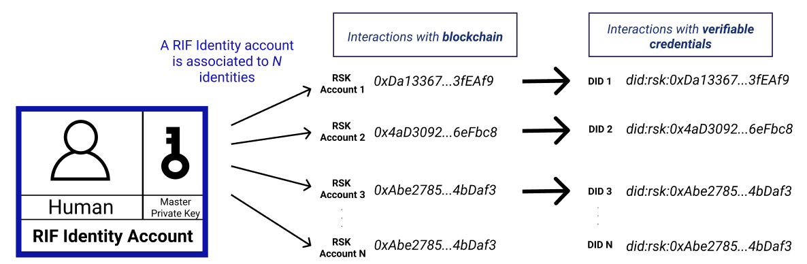
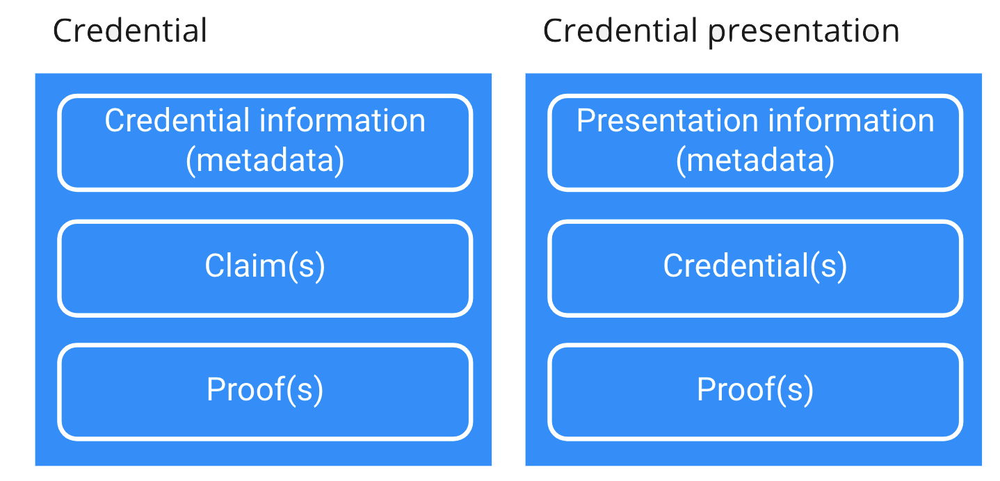
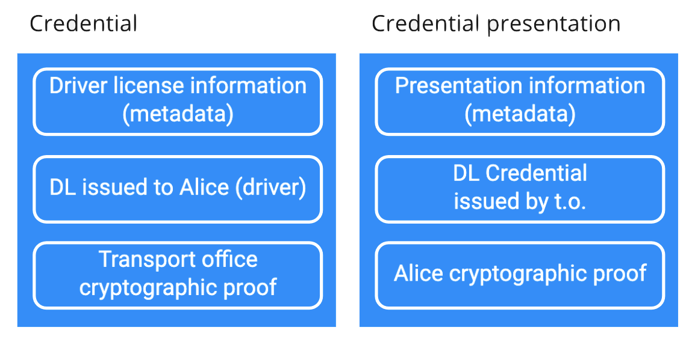

# Specs

RIF Self-sovereign Identity works under a set of JWT-based and blockchain-based protocols building a user centric verifiable credential model.

## Protocols

- [Identity layout](./identity-layout) - create and recover identities
- [Encryption layout](./encryption-layout) - Storing and recovering encrypted information
- [DID authentication](./did-auth) - a challenge–response authentication model based on DIDs
- [Credential requests protocol](./credential-requests) - a simple protocol for request, grant and receive credential case
- [The Convey service](./convey-service) - transport content that does not fit into a QR code
- [Presentations timestamps](./presentation-timestamps) - emitting and validating presentations with timestamps

### What is a JWT?

JSON Web Token (JWT) is a compact, URL-safe means of representing claims to be transferred between two parties.  These claims can be secured with digital signatures or Message Authentication Codes, and/or encrypted with different algorithms. The following is an example of a JWT Claims Set:

     {"iss":"joe",
      "exp":1300819380,
      "http://example.com/is_root":true}

> RIF Identity expresses support for _RFC-7519_

## Identity representation

Decentralized identifiers (DIDs) are a new type of identifier that enables verifiable, decentralized digital identity. A DID identifies any subject such as a person, an organization, a thing, an abstract entity, and so on.

DIDs are URIs that represent the identities in a unique manner - the DID URI contains a public key representing the owner of that identity. A DID identity is mapped to a DID Document that expresses current state of that identity. Control delegations and identity ownership transfers are some of the actions that can be performed to modify the public state of a DID Document - to do so in a secure and public way Rootstock (RSK) blockchain is used.

RIF Identity currently supports `rsk` and `rsk:testnet` Ethr-DID method networks. As an example, this two DIDs are valid RSK and RSK Testnet DIDs:

```
did:ethr:rsk:0x1fab9a0e24ffc209b01faa5a61ad4366982d0b7f
did:ethr:rsk:testnet:0x487ff2e63c8f89a97b6f92d184e2e80fdcdc6ee6
```

> RIF Identity expresses support for _Decentralized Identifiers (DIDs) v1.0_ and _Ethr DID Method Specification_

## Multi identity model

Imagine what would happen if each time you present your national identity card you reveal your blockchain address which can show the amount of funds you have and historical transaction information. To enable users keep their data private and safe, RIF Identity specifies a deterministic identity derivation standard schema that will allow users to obtain multiple public identities for free with the guarantee of recovery on any device.

This schema is based on BIP-32 hierarchical deterministic derivations of public keys. With a seed you can create multiple private keys, those private keys control multiple identities. These identities, as far as the model is correctly designed, do not share information that can associate one with another.

The master key entropy is represented by a BIP-39 mnemonic phrase. The derivation path used for Rootstock (RSK) is `m/44'/137'/0'/0/i` where `i` is used to index different identities.



> RIF Identity expresses support for _BIP-32_, _BIP-39_ and _RSKIP-57_

## Verifiable credentials model

Credentials are a part of our daily lives; driver's licenses are used to assert that we are capable of operating a motor vehicle, university degrees can be used to assert our level of education, and government-issued passports enable us to travel between countries.

If credentials are cryptographically signed, the holder of the credential does not need any action on the issuer to prove that credential was issued by it. In addition, the identity controller of the subject that that credential was issued to can provide a cryptographic proof expressing control of the identity. With this proof schema the verification for a credential presentation consists of proving two cryptographically signed messages.



For example, this model enables a transport office to issue a credential for an approved driver (Alice), that is able to use that credential in a transport control. The officer who verifies the credential does not need access to any centralized database to attest the driving license was issued to the person presenting it.



In general, the model is represented by three different entities:

- Holder
- Issuer
- Verifier

This three entities can perform 4 different basic actions:

- Issue credentials
- Verify credentials
- Present credentials
- Verify presentations

> RIF Identity expresses support for _Verifiable Credentials Data Model 1.0_
